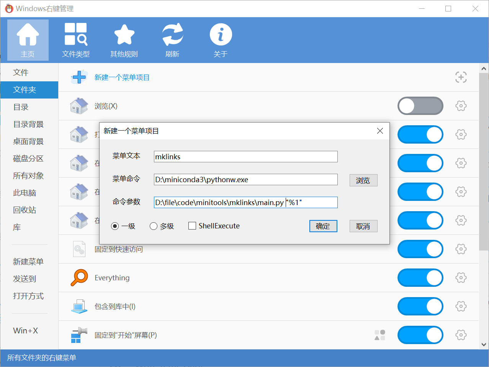
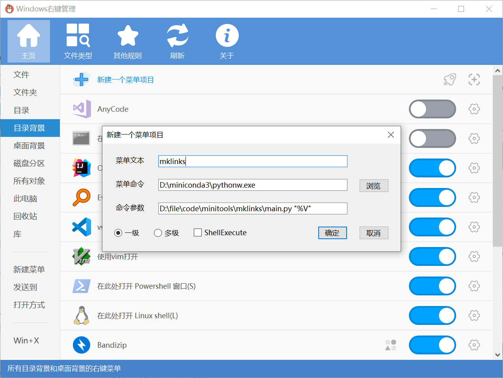

# mklinks

如果需要频繁地将某些文件或文件夹创建符号链接到多个不同目录，那么这个工具可能会对你有所帮助。

例如Obsidian笔记软件不支持全局配置文件，如果你需要使配置文件在多个vault之间共享，那么你可以使用这个工具将配置文件创建符号链接到多个vault中。

- 编写settings.py，添加你想要创建符号链接的文件/文件夹路径

```python
files = [
    r"D:\folder1",
    r"D:\folder2\folder3",
]
```

- 运行

```bash
python main.py D:\destFolder
```

这时候你会发现 `D:\destFolder` 下创建了 `folder1` 和 `folder3` 的符号链接，指向 `D:\folder1` 和 `D:\folder2\folder3`。

- 添加到上下文菜单

如果你不想调用命令行，也可以将其添加到上下文菜单中，这样你只需要右键点击文件夹，或是右键点击目录背景，选择 `mklinks` 即可。你可以使用 [ContextMenuManager](https://github.com/BluePointLilac/ContextMenuManager) 来添加上下文菜单：





注意在文件夹右键菜单中，使用 `"%1"` 代表当前文件夹路径，而在目录背景右键菜单中，使用 `"%V"` 代表当前目录背景路径。