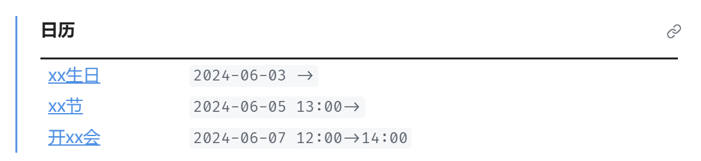

# obsidian-calendar

obsidian日历插件，支持循环事件

## 使用步骤

- 安装 `Obsidian`， `Dataview` 插件 和 `Templater` 插件
- 创建一个文件夹用来存放日程
- 在`Templater` 插件的设置中，启用 `loop.md` 作为该文件夹的 Folder Template，以创建循环事件
- 将 `front-matter-template.md` 放置在这个文件夹中
- 将 `calendar.js` 压缩后，包裹在 `dataviewjs` 代码块中，同样放置在这个文件夹中，便可以查看日程

## 功能

```yaml
loopWeeks: [1,3,7] # 每周1、周3、周7
loopMonths: [1,7,31] # 每月的1号、7号、31号
loopMonths2: [[2,6],[-2,7]] # 每月第2个周六和倒数第2个周日
loopYears: [[1,31],[3,2]] # 每年1月31日和3月2日
loopYears2: [[4,3,1],[1,-1,7]] # 每年4月第3个星期一和1月最后一个星期日
specificDate: [2021-03-04,2021-03-05] # 2021年3月4日和3月5日
startTime: 09:00 # 开始时分，如果为空表示全天事件
endTime: 13:00 # 结束时分
```

## 截图


