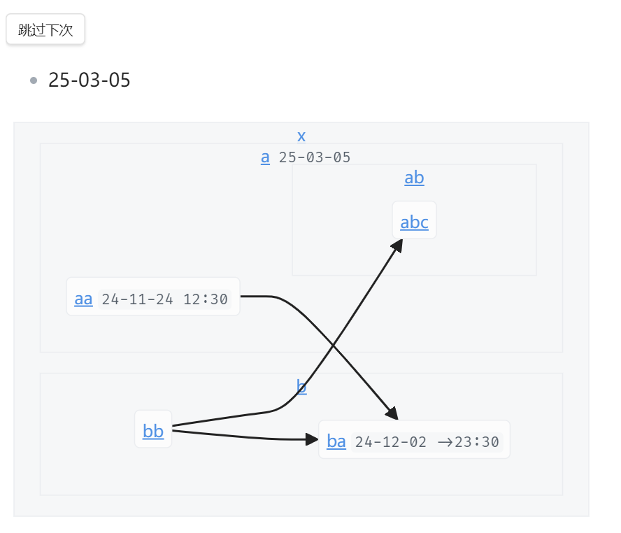
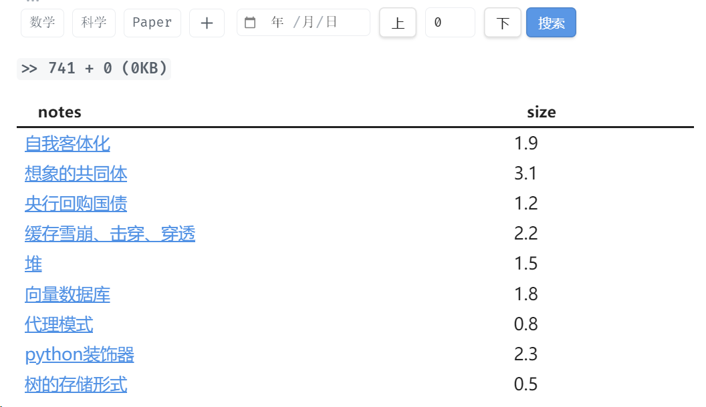
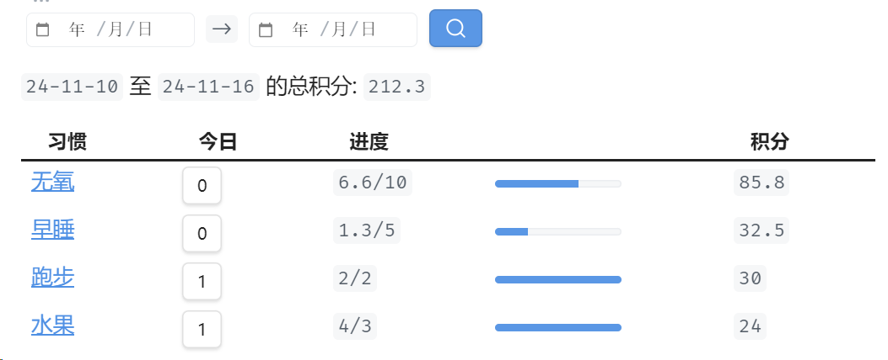
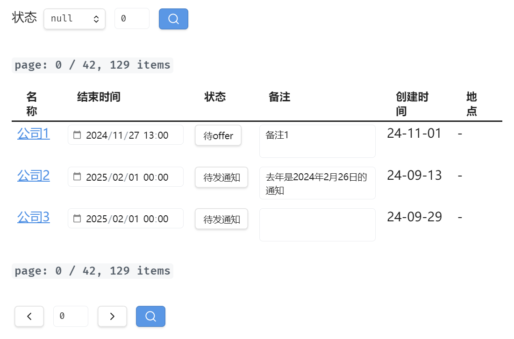
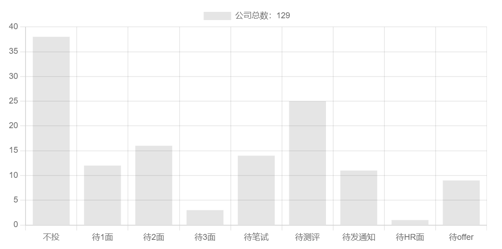
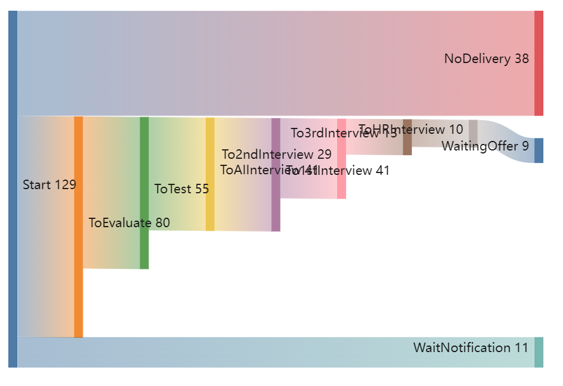

# obsidian-template

obsidian模板，包含任务清单、间隔复习笔记、习惯打卡等插件

使用步骤：

- 为obsidian下载charts、commander、customjs、dataview、metabind、modal forms插件
- 使用obsidian打开vault文件夹

## 任务清单

## 间隔复习笔记

对于每篇笔记：

## 习惯打卡

## 秋招

