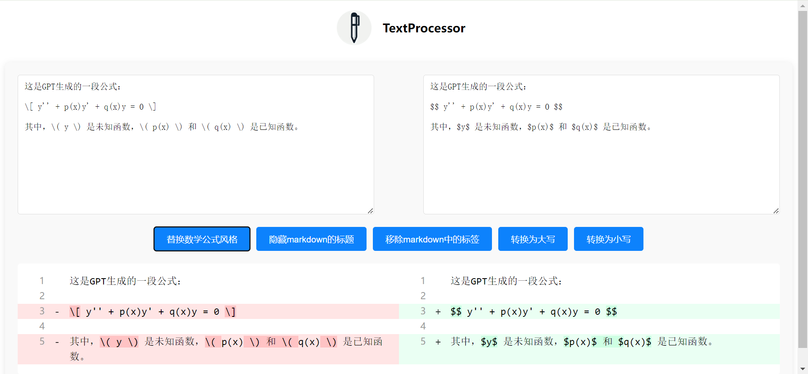

# online-text-processor

基于 Vue.js 的纯前端文本处理工具

## 截图



## 安装

```shell
docker build -t text-processor .
docker run -d -p 80:80 --name text-processor-instance --restart unless-stopped text-processor
```
