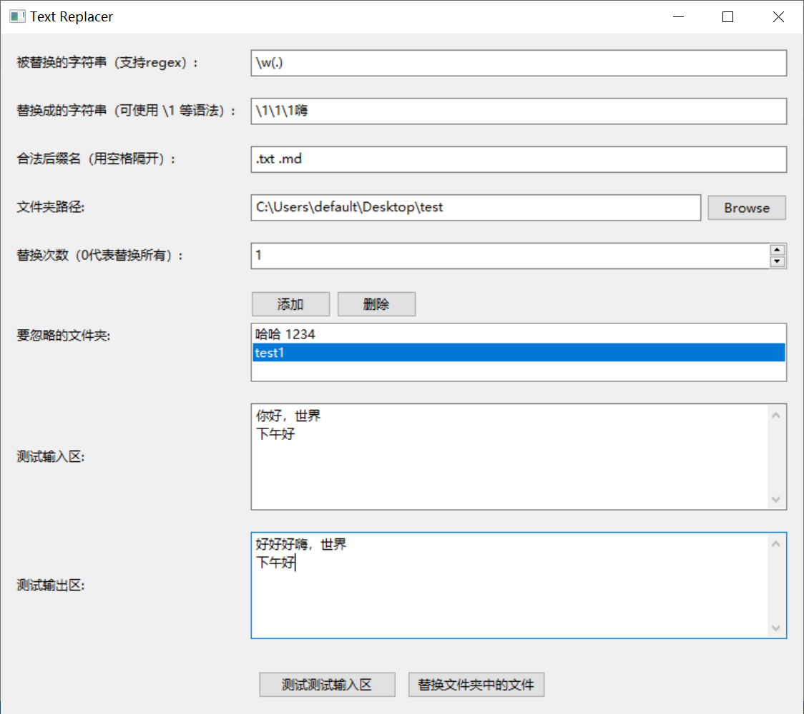
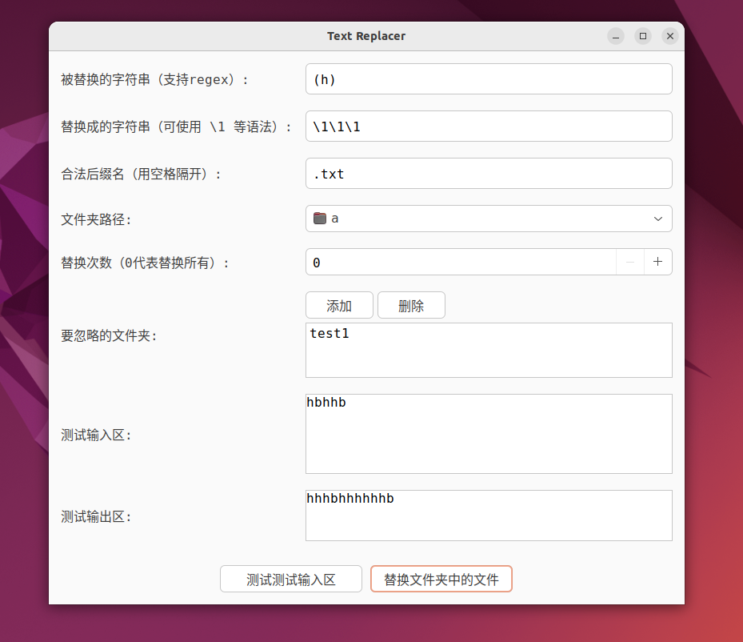

# 替换文本

替换指定文件夹下指定格式的文件中的指定文本

## 安装方法

在Windows下：

```shell
pipenv install
pipenv run python main.py
```

在Linux下：

- 由于[pypi](https://pypi.org/project/wxPython/4.2.1/#files)里面找不到预编译的linux下的wxpython的whl文件，只有Windows和macos下的，因此pipenv会直接从源码编译wxpython，但我没有编译成功
- 但是，wxpython的官网下有预编译版本，因此应该执行 `pipenv run pip install https://extras.wxpython.org/wxPython4/extras/linux/gtk3/ubuntu-22.04/wxPython-4.2.1-cp38-cp38-linux_x86_64.whl`
- 还要安装一些依赖：`sudo apt install libsdl2-2.0-0`
- `pipenv run python main.py`

## 截图




